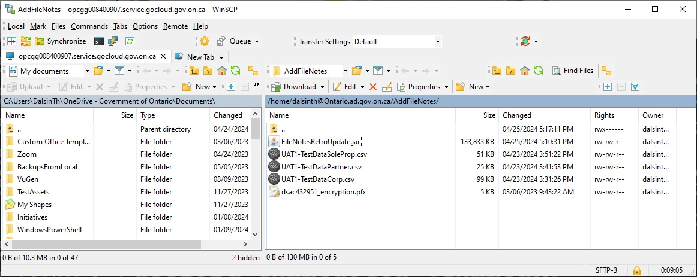

<a name="jmeter-in-a-jar"></a>
# Jmeter in a JAR

Technologies used: Maven, Apache JMeter

<!-- TOC -->
* [JMater in a Jar](#jmeter-in-a-jar)
  * [Requirements](#requirements)
  * [Functionality](#functionality)
  * [Running the app](#running-the-app)
    * [Common Usage](#common-usage)
    * [Encryption Usage](#encryption-usage)
  * [Examples](#examples)
    * [Use Case: UAT1 Encryption](#use-case--uat1-encryption)
    * [Use Case: UAT1 Execute 20 Per File](#use-case--uat1-execute-20-per-file)
<!-- TOC -->

<a name="requirements"></a>
## Requirements
Java8 or later is installed on the system where the utility is executed.

<a name="functionality"></a>
## Functionality

This application will send SOAP messages to a specified environment.
This is made so that a single JAR file can be used to perform batch operations, with an embedded Jmeter instance.

The method by which this application sends these messages is:
- create a temporary folder for the SOAP sending libraries (this application uses the Apache JMeter libraries as its engine; leveraging industry standard technology)
- open one or more CSVs (in the same directory as the JAR file) containing the historical Company Key provisionings
- open any existing log of successfully sent messages (from previous runs)
- open a connection to the specified environment, using the specified certificate (the certificate specifies who authors the FileNote)
- read lines in the CSV one by one, and construct and send an AddFileNote SOAP message for each line
    - if the message was already sent in a previous session, according to the log, this CSV line is skipped (to prevent duplicate File Notes).
    - if the message is successfully sent, the Entity ID, provisioning date, and company key are logged in a success text file in the same directory as the JAR.
    - if the message is unsuccessfully sent, the Entity ID, provisioning date, and company key are logged in failed text file in the same directory as the JAR.
    - if the number of messages sent is equal to the number specified by the run parameters, stop.

See the document "RetrKeyNotes-Approach.docx" for more details on the logic of the application.

<a name="running-the-app"></a>
## Running the app

The app can be found at 

[./target/fileNotesRetroUpdate.jar](target/fileNotesRetroUpdate.jar)

Make sure you have the following in the same folder as your fileNotesRetroUpdate.jar file: 
* a valid certificate (for the environment you're sending notes to)
* 1 or more data files in CSV format



<a name="common-usage"></a>
### Common Usage

`java -jar FileNotesRetroUpdate.jar <ENV> <CERTFILE> <CERTPASSWORD> <XIBMCLIENTID> <DELAY> <ENTITYCOUNT> <CSVLIST>`

Where:

* **\<ENV>**		is the environment where the FileNotes are being added. This is case insensitive. Values include "DEV1" or "dev2" or "uat1" or "UAT2" or "PROD" or "prd"	
* **\<CERTFILE>**	is the certificate file of type PFX (preferrably in the same directory as the JAR file). This is required for the AddFileNotes API so that a user account is attached to the FileNote. For the final result in production, we want the ETL Informatica user to author these file notes. Please use that user's certificate in UAT and Production.
				NOTE: If you are using the application to encrypt values (such as Cert Password and X-IBM Client ID) for a future run or for another user, replace this parameter with the keyword "HashItOut" (case insensitive).
* **\<CERTPASSWORD>**	This is the encrypted password for the PFX certificate. If you have an unencrypted password you will have to first encrypt it using the "hashitout" keyword option.
* **\<XIBMCLIENTID>**	This is the encrypted X-IBM Client ID for the certificate user account on APIC. If you have an unencrypted Client ID you will have to first encrypt it using the "hashitout" keyword option.
* **\<DELAY>**		This is the delay between messages (in milliseconds), which is important to manage throughput and server load. For now the recommended delay on APIC is 500ms, but this can be adjusted based on the time of day (business hours or not) and environment.
* **\<ENTITYCOUNT>**	This is the count for the number of messages to send. If you want all the CSV lines to be sent, use -1. If you want to send 1000, use 1000.
* **\<CSVLIST>**	The list of CSV files (preferrably in the same directory as the JAR file), separated by commas (no spaces please). These files have the Company Key provisioning metadata, used to create the FileNote messages.

- - - - - - - - - -
<a name="encryption-usage"></a>
### Encryption Usage

`java -jar FileNotesRetroUpdate.jar <ENV> <HASHITOUT> <CERTPASSWORD> <XIBMCLIENTID> <INT> <INT> <STRING>`

Where:

* **\<ENV>**		Any valid environment. Values include "DEV1" or "dev2" or "uat1" or "UAT2" or "PROD" or "prd"; when the JAR is used for encryption, this isn't used or processed.
* **\<HASHITOUT>**	The keyword "hashitout" with out without capitalization
* **\<CERTPASSWORD>**	This is the raw password for the PFX certificate.
* **\<XIBMCLIENTID>**	This is the raw X-IBM Client ID for the certificate user account on APIC.
* **\<INT>** 		Any integer; when the JAR is used for encryption, this isn't used or processed.
* **\<STRING>** 	Any string; when the JAR is used for encryption, this isn't used or processed.

<a name="examples"></a>
## Examples

<a name="use-case--uat1-encryption"></a>
### Use Case: UAT1 Encryption
* Preparing to run in UAT1 for the first time.
* Since it’s the first time, the password and Client ID haven’t been encrypted yet.
* Just received these values from the appropriate source (documentation, request, etc.)
* The password is “p@$5w0rd”
* The IBM client ID is “9e29619c7d73b699bea6dbe1”
* Need to encrypt these values before running. This means the cert will be replaced by the keyword “hashitout”
* Doing this in a Linux box, so that dollar sign in the password needs to be escaped.

Terminal Log:
```
java -jar FileNotesRetroUpdate.jar UAT1 hashitout p@\$5w0rd 9e29619c7d73b699bea6dbe1 1 1 foo

sslCertPassword=3ZoFyhL4ee5w83lYXyAllQ==
clientID=9pI/jkgQR1XsCoqj7wfWw2hEB/2NWTcdcZFlRCK8p/8=
```
- - - - - - - - - -
<a name="use-case--uat1-execute-20-per-file"></a>
### Use Case: UAT1 Execute 20 Per File
* Running in UAT1 with newly encrypted password and ClientID
* Using the QA testing certificate,
* Encrypted password is I2NTEuz4IETtgEbVHq2cMw==
* Encrypted ClientID is h2u04l5tZC9OUEdw1AWTX3vbbnSiHRKDVXQnQhRKKyvPTi1Qm0NIGJJpW4/h2hv+
* The advised pause between transaction is 500ms
* Have three data files: UAT1-TestDataPartner.csv, UAT1-TestDataSoleProp.csv, and UAT1-TestDataCorp.csv
* We’re running no more than 20 entries from each data file

Terminal Log:

```
java -jar FileNotesRetroUpdate.jar UAT1 dsac432951_encryption.pfx I2NTEuz4IETtgEbVHq2cMw== h2u04l5tZC9OUEdw1AWTX3vbbnSiHRKDVXQnQhRKKyvPTi1Qm0NIGJJpW4/h2hv+ 500 20 UAT1-TestDataPartner.csv,UAT1-TestDataSoleProp.csv,UAT1-TestDataCorp.csv

2024/05/01 04:44:31:476: Environment: UAT1
2024/05/01 04:44:31:477: SSL Certificate: dsac432951_encryption.pfx
2024/05/01 04:44:31:477: Certificate Password (encrypted): I2NTEuz4IETtgEbVHq2cMw==
2024/05/01 04:44:31:477: X-IBM Client ID (encrypted): h2u04l5tZC9OUEdw1AWTX3vbbnSiHRKDVXQnQhRKKyvPTi1Qm0NIGJJpW4/h2hv+
2024/05/01 04:44:31:477: Time between messages: 500ms
2024/05/01 04:44:31:477: Maximum entities to notify: 20 entities
2024/05/01 04:44:31:478: CSV Files:
2024/05/01 04:44:31:478: - UAT1-TestDataPartner.csv
2024/05/01 04:44:31:478: - UAT1-TestDataSoleProp.csv
2024/05/01 04:44:31:478: - UAT1-TestDataCorp.csv
2024/05/01 04:44:32:470: about to copy /resource/dsac432951_encryption.pfx
2024/05/01 04:44:32:470: destination will be /home/dalsinth@Ontario.ad.gov.on.ca/AddFileNotes/jmeterHome/bin/dsac432951_encryption.pfx
2024/05/01 04:44:32:470: copied 305 files to 5 directories
2024/05/01 04:44:32:603: COMMAND: ./jmeterHome/bin/jmeter -n -t ./RetroactiveKeyNotes-JAR.jmx -l ./NotesAddedExec-240501-044432.jtl -JnotesPauseTime=500 -JenvParam=UAT1 -JsendCount=20 -JibmClientId=dc7d73d32e57b9cb7b0a69b06ea6dbe1 -JdataFileCsv=UAT1-TestDataPartner.csv
2024/05/01 04:44:32:603: OS=Linux
2024/05/01 04:44:35:232: Creating summariser <summary>
2024/05/01 04:44:35:233: Created the tree successfully using ./RetroactiveKeyNotes-JAR.jmx
2024/05/01 04:44:35:244: Starting standalone test @ May 1, 2024 4:44:35 PM EDT (1714596275239)
2024/05/01 04:44:35:249: Waiting for possible Shutdown/StopTestNow/HeapDump/ThreadDump message on port 4445
2024/05/01 04:45:01:143: summary +     17 in 00:00:25 =    0.7/s Avg:   893 Min:   512 Max:  2202 Err:     0 (0.00%) Active: 1 Started: 1 Finished: 0
2024/05/01 04:45:29:443: summary +     23 in 00:00:28 =    0.8/s Avg:   701 Min:   481 Max:   909 Err:     0 (0.00%) Active: 0 Started: 1 Finished: 1
2024/05/01 04:45:29:443: summary =     40 in 00:00:54 =    0.7/s Avg:   783 Min:   481 Max:  2202 Err:     0 (0.00%)
2024/05/01 04:45:29:443: Tidying up ...    @ May 1, 2024 4:45:29 PM EDT (1714596329442)
2024/05/01 04:45:29:443: ... end of run
2024/05/01 04:45:31:568: COMMAND: ./jmeterHome/bin/jmeter -n -t ./RetroactiveKeyNotes-JAR.jmx -l ./NotesAddedExec-240501-044432.jtl -JnotesPauseTime=500 -JenvParam=UAT1 -JsendCount=20 -JibmClientId=dc7d73d32e57b9cb7b0a69b06ea6dbe1 -JdataFileCsv=UAT1-TestDataSoleProp.csv
2024/05/01 04:45:31:568: OS=Linux
2024/05/01 04:45:34:368: Creating summariser <summary>
2024/05/01 04:45:34:369: Created the tree successfully using ./RetroactiveKeyNotes-JAR.jmx
2024/05/01 04:45:34:380: Starting standalone test @ May 1, 2024 4:45:34 PM EDT (1714596334375)
2024/05/01 04:45:34:385: Waiting for possible Shutdown/StopTestNow/HeapDump/ThreadDump message on port 4445
2024/05/01 04:46:00:566: summary +     18 in 00:00:26 =    0.7/s Avg:   849 Min:   534 Max:  1469 Err:     0 (0.00%) Active: 1 Started: 1 Finished: 0
2024/05/01 04:46:28:107: summary +     22 in 00:00:28 =    0.8/s Avg:   723 Min:   522 Max:   943 Err:     0 (0.00%) Active: 0 Started: 1 Finished: 1
2024/05/01 04:46:28:107: summary =     40 in 00:00:53 =    0.8/s Avg:   779 Min:   522 Max:  1469 Err:     0 (0.00%)
2024/05/01 04:46:28:107: Tidying up ...    @ May 1, 2024 4:46:28 PM EDT (1714596388107)
2024/05/01 04:46:28:107: ... end of run
2024/05/01 04:46:29:593: COMMAND: ./jmeterHome/bin/jmeter -n -t ./RetroactiveKeyNotes-JAR.jmx -l ./NotesAddedExec-240501-044432.jtl -JnotesPauseTime=500 -JenvParam=UAT1 -JsendCount=20 -JibmClientId=dc7d73d32e57b9cb7b0a69b06ea6dbe1 -JdataFileCsv=UAT1-TestDataCorp.csv
2024/05/01 04:46:29:594: OS=Linux
2024/05/01 04:46:32:368: Creating summariser <summary>
2024/05/01 04:46:32:369: Created the tree successfully using ./RetroactiveKeyNotes-JAR.jmx
2024/05/01 04:46:32:380: Starting standalone test @ May 1, 2024 4:46:32 PM EDT (1714596392375)
2024/05/01 04:46:32:386: Waiting for possible Shutdown/StopTestNow/HeapDump/ThreadDump message on port 4445
2024/05/01 04:47:00:535: summary +     19 in 00:00:28 =    0.7/s Avg:   856 Min:   520 Max:  1802 Err:     0 (0.00%) Active: 1 Started: 1 Finished: 0
2024/05/01 04:47:26:842: summary +     21 in 00:00:26 =    0.8/s Avg:   722 Min:   499 Max:   937 Err:     0 (0.00%) Active: 0 Started: 1 Finished: 1
2024/05/01 04:47:26:842: summary =     40 in 00:00:54 =    0.7/s Avg:   785 Min:   499 Max:  1802 Err:     0 (0.00%)
2024/05/01 04:47:26:843: Tidying up ...    @ May 1, 2024 4:47:26 PM EDT (1714596446842)
2024/05/01 04:47:26:843: ... end of run
2024/05/01 04:47:27:651: complete!
```
